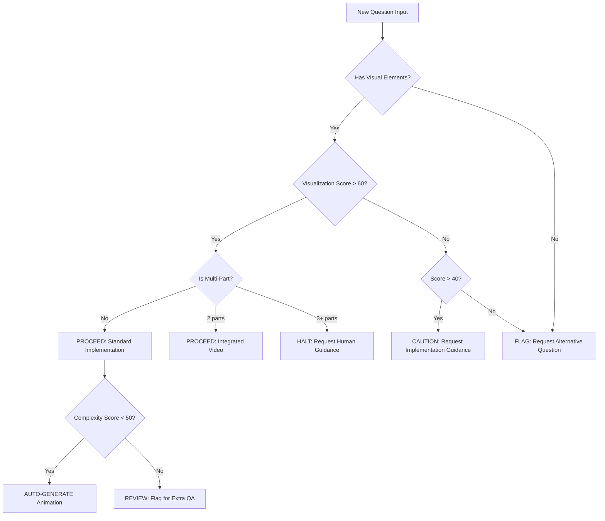

# 10. Edge Cases & Fallback Procedures

## 10.1 Visualization Difficulty Assessment

**Question Visualization Rubric:**
```python
class VisualizationAssessor:
    """
    Determine if a question can be effectively animated
    """
    
    def assess_visualization_feasibility(self, question_data: dict) -> dict:
        """
        Score question on visualization potential
        Returns recommendation for proceed/flag/reject
        """
        scores = {
            'has_diagram': 0,
            'quantitative': 0,
            'process_based': 0,
            'concrete_concept': 0,
            'animation_value': 0
        }
        
        # Scoring logic
        if self._has_visual_element(question_data):
            scores['has_diagram'] = 25
        
        if self._is_quantitative(question_data):
            scores['quantitative'] = 20
        
        if self._describes_process(question_data):
            scores['process_based'] = 25
        
        if self._is_concrete_vs_abstract(question_data):
            scores['concrete_concept'] = 15
        
        if self._animation_adds_value(question_data):
            scores['animation_value'] = 15
        
        total_score = sum(scores.values())
        
        # Decision logic
        if total_score >= 60:
            decision = "PROCEED - Good visualization potential"
            action = "auto_proceed"
        elif total_score >= 40:
            decision = "CAUTION - Moderate visualization potential"
            action = "request_guidance"
        else:
            decision = "FLAG - Poor visualization potential"
            action = "suggest_alternative"
        
        return {
            'total_score': total_score,
            'breakdown': scores,
            'decision': decision,
            'action': action,
            'alternative_suggestions': self._suggest_alternatives(question_data)
        }
    
    def _has_visual_element(self, data: dict) -> bool:
        """Check if question includes diagrams, graphs, or spatial relationships"""
        visual_indicators = ['diagram', 'graph', 'figure', 'shown', 'illustrated']
        return any(ind in data.get('question_text', '').lower() for ind in visual_indicators)
    
    def _is_quantitative(self, data: dict) -> bool:
        """Check if question involves calculations or numerical values"""
        return bool(re.search(r'\d+\.?\d*', data.get('question_text', '')))
    
    def _describes_process(self, data: dict) -> bool:
        """Check if question involves a process or mechanism"""
        process_keywords = ['explain', 'describe how', 'what happens when', 
                          'process', 'mechanism', 'sequence']
        return any(kw in data.get('question_text', '').lower() for kw in process_keywords)
    
    def _is_concrete_vs_abstract(self, data: dict) -> bool:
        """Determine if concept has concrete visual representation"""
        abstract_topics = ['democracy', 'ethics', 'philosophy', 'definition']
        return not any(topic in data.get('topic', '').lower() for topic in abstract_topics)
    
    def _animation_adds_value(self, data: dict) -> bool:
        """
        Determine if animation provides value over static image
        Questions involving motion, change over time, or transformations score high
        """
        animation_keywords = ['motion', 'velocity', 'acceleration', 'reaction', 
                             'growth', 'change', 'transform', 'flow']
        return any(kw in data.get('question_text', '').lower() for kw in animation_keywords)
    
    def _suggest_alternatives(self, data: dict) -> List[str]:
        """Suggest alternative questions if this one scores poorly"""
        return [
            "Find a similar question with a diagram or graph",
            "Look for a question involving a process or calculation",
            "Select a question from a different topic with better visual potential"
        ]
```

## 10.2 Multi-Part Question Handling

**Multi-Part Question Protocol:**
```python
class MultiPartQuestionHandler:
    """
    Handle questions with multiple parts (a, b, c, etc.)
    """
    
    def analyze_question_parts(self, question_text: str) -> dict:
        """
        Detect and analyze multi-part questions
        """
        # Detect parts using common patterns
        parts = re.findall(r'\(([a-e])\)', question_text)
        
        if len(parts) == 0:
            return {
                'is_multipart': False,
                'num_parts': 0,
                'handling': 'standard'
            }
        
        elif len(parts) <= 2:
            return {
                'is_multipart': True,
                'num_parts': len(parts),
                'handling': 'combine_in_one_video',
                'recommendation': 'Parts are related, create integrated explanation'
            }
        
        else:  # 3+ parts
            return {
                'is_multipart': True,
                'num_parts': len(parts),
                'handling': 'request_approval',
                'recommendation': 'Question has multiple parts. Options:\n'
                                '1. Create series of videos (Part 1/3, 2/3, 3/3)\n'
                                '2. Select only the most visual part\n'
                                '3. Choose different question',
                'requires_human_decision': True
            }
    
    def create_multipart_series(self, question_data: dict, parts: List[dict]) -> List[dict]:
        """
        Generate series metadata for multi-part question
        """
        series_data = []
        for i, part in enumerate(parts, 1):
            series_data.append({
                'part_number': i,
                'total_parts': len(parts),
                'title_suffix': f"Part {i} of {len(parts)}",
                'question_data': part,
                'series_id': f"{question_data['id']}_part{i}"
            })
        return series_data
```

## 10.3 Fallback Decision Tree

**Automated Decision Flow:**


**Implementation:**
```python
class AutomatedDecisionEngine:
    """
    Automated decision-making for question handling
    """
    
    def __init__(self):
        self.visualizer = VisualizationAssessor()
        self.difficulty = DifficultyAnalyzer()
        self.multipart = MultiPartQuestionHandler()
    
    def process_question(self, question_data: dict) -> dict:
        """
        Run all assessments and return handling decision
        """
        # Step 1: Check visualization feasibility
        viz_assessment = self.visualizer.assess_visualization_feasibility(question_data)
        
        if viz_assessment['action'] == 'suggest_alternative':
            return {
                'decision': 'REJECT',
                'reason': 'Poor visualization potential',
                'next_action': 'Request different question',
                'suggestions': viz_assessment['alternative_suggestions']
            }
        
        # Step 2: Check for multi-part
        multipart_analysis = self.multipart.analyze_question_parts(
            question_data.get('question_text', '')
        )
        
        if multipart_analysis.get('requires_human_decision'):
            return {
                'decision': 'HUMAN_REVIEW',
                'reason': 'Multi-part question with 3+ parts',
                'next_action': multipart_analysis['recommendation'],
                'multipart_data': multipart_analysis
            }
        
        # Step 3: Check complexity
        complexity = self.difficulty.assess_question(question_data)
        
        if not complexity['auto_proceed']:
            return {
                'decision': 'HUMAN_REVIEW',
                'reason': f"High complexity (score: {complexity['complexity_score']})",
                'next_action': 'Request implementation guidance',
                'recommendations': complexity['recommendations']
            }
        
        # Step 4: Proceed with generation
        return {
            'decision': 'PROCEED',
            'reason': 'All checks passed',
            'next_action': 'Auto-generate animation',
            'complexity_score': complexity['complexity_score'],
            'viz_score': viz_assessment['total_score'],
            'special_handling': multipart_analysis.get('handling', 'standard')
        }
```

---
